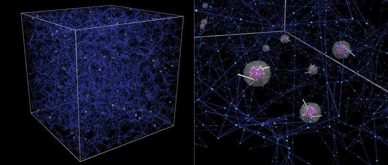

<p align="center">
  
</p>

# Cellfoundry

**Cellfoundry** is a multi-physics, agent-based simulation framework built on FLAMEGPU2 for studying the cellular microenvironment.

The framework integrates interacting cells, extracellular matrix (ECM), fibre networks, diffusing chemical species, and mechanical interactions within a unified, GPU-accelerated model. Cellfoundry is designed for in vitro and organoid-scale studies, enabling systematic investigation of how biochemical transport, mechanics, and microstructural organisation jointly regulate cell behaviour.

Cellfoundry is modular, extensible, and suitable for large-scale parameter studies, digital twin development, and mechanobiology-driven hypothesis testing.

<p align="center">
  
</p>
<p align="center">
  <em>Showcase of 100 cells migrating through the extracellular matrix,
  illustrating how adhesion formation, force transmission, and detachment contribute to the resulting trajectories and long-range force transmission.
  CELL agents are represented as semi-transparent spheres, including nuclei (coloured by deformation) and nuclei anchor points (white).
  FOCAD agents are shown as straight rods coloured by adhesion state (green means attached).
  The surrounding matrix is visualised through the positions of FNODE agents (small light blue spheres on the right panel), joined by lines (fibres)
  whose colour reflect their local elastic energy. This video highlights the dynamic interplay between cellular motility and matrix mechanics in a complex microenvironment.</em>
</p>

This is a work in active development with new features added progressively. Check branches for newest (experimental) features. For detailed documentation, visit the [Cellfoundry Wiki](https://github.com/cborau/cellfoundry/wiki) and the appendix files of [this paper](https://www.biorxiv.org/content/10.64898/2026.04.22.720218v1).

# Citation

If you use this framework in your research, please cite the following paper:

```bibtex
@article{Borau2026.04.22.720218,
  author    = {Borau, C. and Chisholm, R. and Richmond, P.},
  title     = {Cellfoundry: a GPU-accelerated, multi-physics ABM framework for cellular microenvironment and organoid-scale studies},
  journal   = {bioRxiv},
  year      = {2026},
  doi       = {10.64898/2026.04.22.720218},
  publisher = {Cold Spring Harbor Laboratory},
  URL       = {https://www.biorxiv.org/content/early/2026/04/25/2026.04.22.720218},
  eprint    = {https://www.biorxiv.org/content/early/2026/04/25/2026.04.22.720218.full.pdf},
}
```

# Quick Installation Guide (Windows, CUDA 12.4, Python 3.10)

Official references:
- FLAME GPU documentation: https://docs.flamegpu.com/
- Installation guide: https://docs.flamegpu.com/guide/index.html
- Official wheelhouse (latest releases): https://whl.flamegpu.com/

If you encounter issues, always refer to the official FLAME GPU installation guide.

---

## 1. Check NVIDIA Drivers

Open PowerShell and run:

```powershell
nvidia-smi
```

You should see:
- Your GPU model
- Driver version
- CUDA version (driver capability)

If `nvidia-smi` fails:
- Install or update your NVIDIA GPU driver.
- Reboot if necessary.

---

## 2. Install CUDA Toolkit (Example: CUDA 12.4)

Download and install the desired CUDA Toolkit from NVIDIA (https://developer.nvidia.com/cuda-toolkit-archive). After installation, open a new PowerShell and verify:

```powershell
nvcc --version
```

Expected:
- `nvcc` prints the installed version (in this case 12.4)

---

## 3. Create and Activate a Conda Environment

Create a clean environment with Python 3.10:

```powershell
conda create -n flamegpu_py310 python=3.10
conda activate flamegpu_py310
```

Upgrade pip:

```powershell
python -m pip install --upgrade pip
```

Install needed libraries:

Manually: 
```powershell
conda install pandas numpy matplotlib scipy PySide6
```

Via requisites file: 
```powershell
python -m pip install -r requirements.txt
```

---

## 4. Install FLAME GPU Wheels (CUDA 12.4)

FLAME GPU wheels are hosted at: https://whl.flamegpu.com/
Pick the one corresponding to your operating system and CUDA version.

Two variants are available:
- **ON** → Visualization enabled (useful for quick debugging and model inspection)
- **OFF** → Visualization disabled (lighter)

**Visualization ON (recommended for development)**

```powershell
python -m pip install --extra-index-url https://whl.flamegpu.com/whl/cuda124-vis/ pyflamegpu
```

**Visualization OFF**

```powershell
python -m pip install --extra-index-url https://whl.flamegpu.com/whl/cuda124/ pyflamegpu
```

**If reinstalling:**

```powershell
python -m pip install --force-reinstall --no-cache-dir --extra-index-url https://whl.flamegpu.com/whl/cuda124-vis/ pyflamegpu
```

---

## 5. Test Import

Activate your environment and test:

```powershell
conda activate flamegpu_py310
python -c "import pyflamegpu; print('pyflamegpu OK')"
```

If this prints without errors, installation is complete.

---

## Troubleshooting

If you encounter any of the following:
- `nvrtc64_120_0.dll not found` or some other .dll is missing
- `DLL load failed while importing _pyflamegpu`
- `nvcc not recognized`

Verify:
1. CUDA Toolkit 12.4 is installed.
2. CUDA `bin` directory is on PATH.
3. You are inside the correct conda environment.
4. You installed the wheel matching your CUDA version.

For detailed troubleshooting, refer to: https://docs.flamegpu.com/guide/index.html
